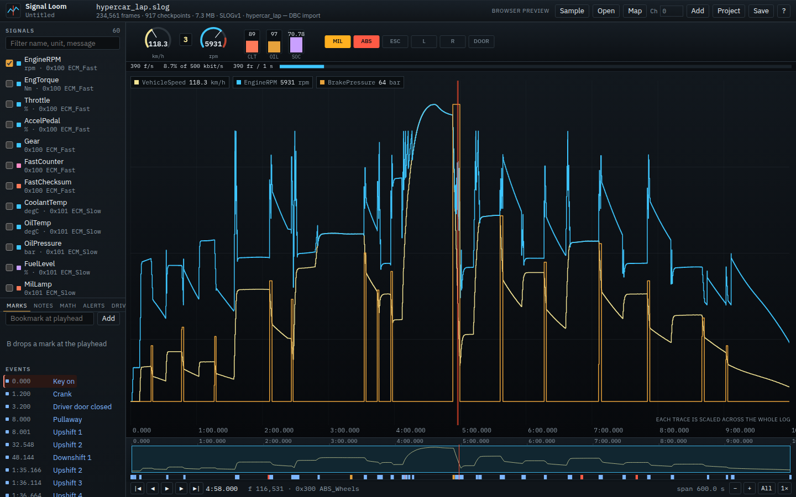
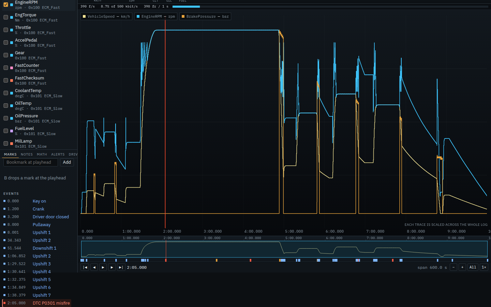
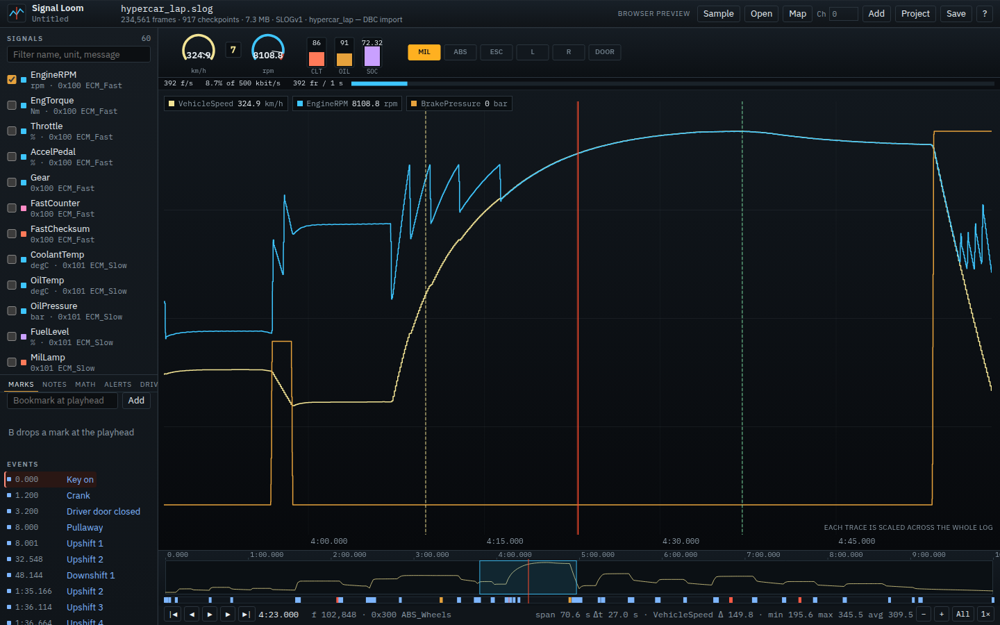
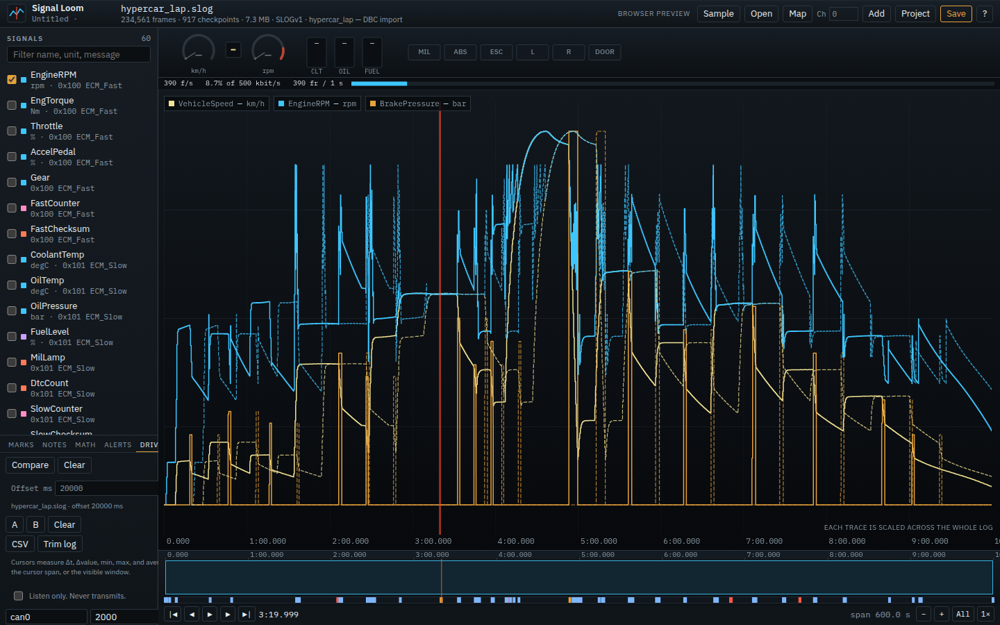
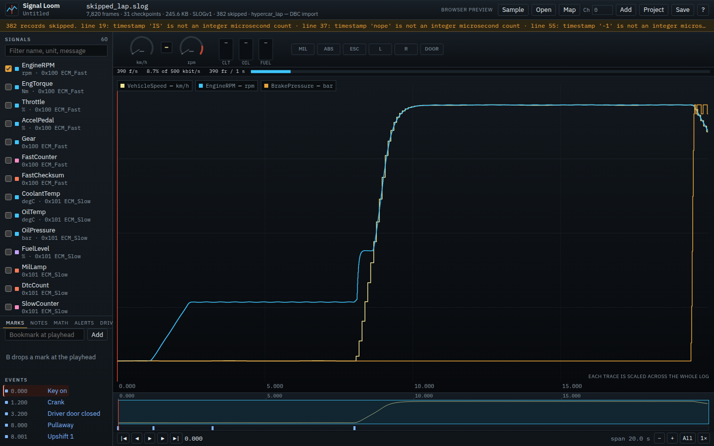

# Signal Loom

Signal Loom is a desktop log, CAN, and telemetry browser. Drop a recording on the deck, scrub the timeline, decode signals, overlay them, and bookmark events. It is built for instrument-cluster and vehicle work: a DAW for buses, not a slicer.

The heavy work stays in Rust. The window is a Tauri 2 shell. The UI is TypeScript and Vite, and it only asks the indexer for the samples currently on screen.

## Screenshots

Desktop layout at 1440×900, after indexing finished. The first four pictures use the synthetic hypercar lap, `fixtures/hypercar_lap.slog` with `fixtures/hypercar_lap.dbc`. That recording is generated, not a capture from a vehicle. The last picture is a slice of the same lap with bad lines mixed in.



The instrument deck mid-drive. Gauges and telltales follow the playhead, and the timeline keeps the whole ten minutes.



A planted fault selected. The row tracks the playhead, and the lane under the minimap is coloured by severity.



Cursors A and B on the highway section. The transport shows Δt plus min, max, and average for the first plotted signal.



The same lap opened as a second drive and shifted 20 seconds. Solid traces are the deck; dashed traces are the compare log.



A short extract of the lap with malformed lines. The amber strip counts the skipped records and quotes the first warnings. The rest of the file still opens.

## Run it

Requirements: Node.js 22+, a current stable Rust toolchain, and the [Tauri Linux prerequisites](https://tauri.app/start/prerequisites/) (`webkit2gtk`, `gtk`, `librsvg`, `patchelf`) when you are on Linux.

```bash
npm install
npm run tauri dev
```

That builds the Rust core, starts Vite on [http://127.0.0.1:43127](http://127.0.0.1:43127), and opens the Signal Loom window. The first launch compiles Tauri, so it takes a while. Later launches are ordinary.

### Browser preview

The same UI can run against a localhost copy of the indexer. This is for layout checks. The shipping app is the Tauri shell. Nothing listens on a public interface.

```bash
npm run dev:preview
```

Vite stays on port 43127 and proxies `/api` to `loom-serve` on `127.0.0.1:43128`. The page shows a **Browser preview** badge. File open uses the browser file picker; the bytes are indexed by the local Rust process.

An uploaded project has no folder, so a relative log, map, or compare path in it is not resolved against the engine's working directory. The log is refused. A map or compare log is reported and left unopened.

## What's on the deck

Sample opens `fixtures/hypercar_lap.slog` with `fixtures/hypercar_lap.dbc` when those files are on disk. That is a synthetic 10-minute hybrid drive (urban, several corners, a chicane, a short top-speed straight, a second shorter straight, and a pit), not a capture from a vehicle. Speed is integrated from the torque curve, gear ratio, drag, rolling resistance, mass, a slow grade, and wind. The top-speed straight is a few tens of seconds in top gear, under the rev limiter, and ends in a brake application. Message ids are invented. The log plants a DTC, a counter skip, a missing ECM cycle, a bus-off burst, and one bad ABS checksum. `fixtures/cluster_drive.slog` is a shorter cluster trace, with `fixtures/cluster.map.json`. `fixtures/demo.loom` points at that shorter trace. `fixtures/decoded_snippet.csv` is a tiny pre-decoded trace. The screenshots above use the 10-minute lap. The skipped-record picture is a slice of that lap with bad lines inserted.

`fixtures/hypercar_lap.dbc` is committed. `fixtures/hypercar_lap.slog` is not: the app reads it from disk when it is present and otherwise falls back to the short cluster sample, and the Rust test that checks the lap only needs the generated file. Regenerate it locally, and CI writes it before `cargo test`:

```bash
python3 scripts/gen_fixture.py
```

## What is real

- **SLOGv1 text**, **SLB1 binary**, **CAN CSV** (`t_us,id,data`), **decoded CSV** (`t_us,signal,value`), **Vector ASC** (absolute or relative time, CAN FD, extended ids, several channels), **Vector BLF** (classic CAN, CAN FD, error frames, zlib containers streamed one at a time), and **candump** lines with or without an interface name are parsed and indexed.
- A large file is streamed. The index keeps at most 4096 checkpoints and does not load the recording into one buffer. Opening a path shows percent, frame count, and a cancel button. A bad line or a truncated record is skipped, counted, and listed; the rest of the log still opens. Records up to 50 ms out of order, as Tx and Rx lines often are in a real capture, are kept at the previous timestamp and counted. An ASC whose time column holds whole microseconds instead of seconds is detected and read as microseconds, and tool-level `Node.Message` lines without a CAN id are left out with one note.
- JSON signal maps and Vector `.dbc` files are decoded for real: little-endian (Intel) and big-endian (Motorola) bit layouts, signed values, factor, offset, multiplexed signals, and `VAL_` labels. A second DBC can be added on a channel. Channel 0 applies everywhere. The header shows how many of the map's messages the log carries. A map kept from the previous log that matches none of the new log's messages is set aside with a note, and a DBC that matches nothing is flagged; signals with no data are listed last and dimmed. Signals can sit anywhere in a 64-byte CAN FD payload. A signal name that repeats across messages, such as `Counter` or `CRC`, is kept as `Name@<id>`, and a signal with a broken layout is skipped and listed; the rest of the DBC still loads.
- `.loom` projects store the log path, map path, bookmarks, playhead, span, plotted signals, math channels, triggers, notes, cursors, and an optional compare log. A math channel or trigger that does not validate is dropped with a warning when the project opens, and an out-of-range timeout is reported and the default, 2.5, is used. A save is refused if the project would not load cleanly. Saves write a temporary file and rename it over the old one, so an interrupted save keeps the old file.
- Scrub, frame step, event step, playback, and overlay plots call that indexer. The plot keeps a hover crosshair, measurement cursors, and wheel zoom anchored on the cursor.
- A cluster strip (two dials, a digit, three bars and six lamps) and a one-second bus-load strip follow the playhead. Click a gauge or lamp to put any signal in it; an assigned signal scales to its own range, and the assignments are saved with the project. Without assignments the cluster shows the sample's speed, rpm, gear, temperatures, SoC or fuel, and telltales. The timeline is a minimap of the whole drive, with an event lane coloured by severity.
- Math channels (`WheelFL - WheelFR`, `abs`, `lp`), threshold triggers, cursor statistics, CSV and trimmed SLOGv1 export (a Save dialog on the desktop, a download in the browser preview), and a second log aligned by a time offset. An export that reaches the 500,000-row cap ends with a `#` note line, and the UI shows a notice.
- With a DBC or map loaded, a message late by more than 2.5 cycle times (set on the Alerts tab and saved with the project), a broken counter, or a bad checksum is marked on the event lane. The checksum scheme is recognised from the first 16 frames: XOR, byte sum, CRC-8/SAE-J1850 or CRC-8H2F over the other bytes. A frame with a bad checksum is rejected before its counter is checked, as an ECU does.
- SocketCAN capture is opt-in and Linux-only. The socket is opened read-only. Signal Loom does not transmit.
- While a log is indexing, the viewport blurs and dims and the veil shows progress. The signal list stays put.

## What is not in this build

- No cloud account. The app stays offline. Logs are read from local disk; nothing is uploaded.
- A `.loom` project does not follow a network path (`\\server\share\…`) for its log, map, or compare log: on Windows, merely checking such a path signs in to that server. Open a network file with Open instead.
- A math channel cannot use another math channel. The app refuses it and asks you to write the expression in full.
- SocketCAN never sends a frame. There is no transmit path.
- The browser preview upload is capped at 32MB. Multi-gigabyte logs are opened by path.
- The checksum watch is an XOR of the other payload bytes, matched by signal name. It is not an AUTOSAR CRC.
- BLF objects other than classic CAN, CAN FD, error frames, and zlib containers are skipped.
- The 10-minute lap is read from disk. A packaged build without the fixture falls back to the short cluster sample.

No decode path is mocked. The browser preview uses the same `loom-core` crate over localhost.

## Keyboard

| Action | Keys |
| --- | --- |
| Open log | Ctrl/Cmd+O |
| Open project | Ctrl/Cmd+Shift+O |
| Save / save as | Ctrl/Cmd+S, Ctrl/Cmd+Shift+S |
| Load sample | Ctrl/Cmd+Shift+L |
| Frame step | Left / Right |
| Event or bookmark step | Shift+Left / Shift+Right |
| Play / pause | Space |
| Bookmark the playhead | B |
| Note at the playhead | N |
| Measurement cursors | 1 and 2 |
| Zoom | `[` `]` or the wheel, anchored on the cursor |
| Pan | Alt+drag, or Shift+wheel |
| Filter signals | `/` |

Transport buttons are slim on purpose.

## Log formats

SLOGv1, times in microseconds:

```text
SLOGv1
F 0 1A0 800C881378640000
E 2000000 Pullaway
```

`F` is a frame: timestamp, hex CAN id, hex payload (1–64 bytes). `E` is an event label. `X` is an error frame. `#` comments are ignored. A malformed line is skipped.

SLB1 is a little-endian binary: 16-byte header (`SLB1`, version 1), then records tagged `1` (frame: `u64` time, `u32` id, `u8` dlc, 8 data bytes) or `2` (event: `u64` time, `u16` length, utf-8 label).

CAN CSV ids are decimal unless they contain `A–F` or a `0x` prefix. Timestamps are always integer microseconds. A record that steps backwards in time is skipped and counted, so one glitch does not throw away the rest of the file.

Vector ASC is the text export (`base hex` or `base dec`, absolute or relative timestamps, `CANFD`, an id ending in `x` for 29-bit). BLF reads `LOGG` / `LOBJ` containers, including zlib, one container at a time (an inflated container is capped at 8MB and then discarded). CAN FD frames keep up to 64 data bytes, with their channel and extended-id flag. candump lines look like `(seconds) can0 1A0#1122`, `(seconds) 1A0#1122`, or `can0 1A0 [8] 11 22 …`. Epoch candump clocks are rebased to the first frame. A line with no timestamp takes the time of the record before it.

A signal map looks like `fixtures/cluster.map.json`: messages, a CAN id, an optional `channel`, and signals with `startBit`, `bitLength`, `factor`, `offset`, `endian` (`little` or `big`), and optional multiplex fields. A Vector `.dbc` (`BO_` / `SG_` / `VAL_` / `GenMsgCycleTime`) imports to the same decoder. `SG_ … M` is the multiplexor; `m0`, `m1`, … are the cases. A log named `drive.slog` picks up `drive.dbc` beside it, or `drive.map.json` if there is no DBC. Add attaches another DBC on the channel in the toolbar.

## Project file

`.loom` is JSON:

```json
{
  "format": "signal-loom",
  "version": 1,
  "logPath": "fixtures/cluster_drive.slog",
  "signalMapPath": "fixtures/cluster.map.json",
  "bookmarks": [{ "id": "pullaway", "tUs": 2000000, "label": "Pullaway" }],
  "view": { "playheadUs": 2000000, "spanUs": 45000000, "plotted": ["VehicleSpeed"] }
}
```

Paths resolve relative to the project file, then by walking parent directories. The built-in sample still opens if a project names `cluster_drive.slog` and the file is not on disk.

## Layout

```text
crates/loom-core     parse, index, decode, window query
crates/loom-serve    localhost preview of that crate
src-tauri            Tauri 2 shell, unsigned builds
src                  Vite + TypeScript UI
fixtures             sample log, map, project, CSV snippet
```

## Checks

```bash
python3 scripts/gen_fixture.py
npm run typecheck
npm run build
cargo test -p loom-core
cargo clippy -p loom-core -p loom-serve --all-targets -- -D warnings
cargo check -p signal-loom
```

`.github/workflows/ci.yml` keeps three job names stable: `frontend`, `rust`, and `tauri-smoke`.

## Installers

`.github/workflows/release.yml` builds unsigned installers on `workflow_dispatch` and on `v*` tags. Windows is an NSIS setup (`Signal Loom_0.1.0_x64-setup.exe` at the current version). Linux builds a `.deb` and an AppImage. macOS builds two dmgs, Apple silicon and Intel, after installing that job's Rust target on the stable toolchain pinned in `rust-toolchain.toml`. The installer name and wizard use the product name **Signal Loom**, with `src-tauri/icons/icon.ico` (Windows) and `icon.icns` (macOS).

This repository (`cristy-the-one/signal-loom`) is the main copy of Signal Loom. GitHub Actions runs CI and attaches the unsigned installers, including the Windows `x64-setup.exe`, to a draft GitHub Release. The Origin repository `marius-cristian/signal-loom` is the archived original and is no longer updated.
